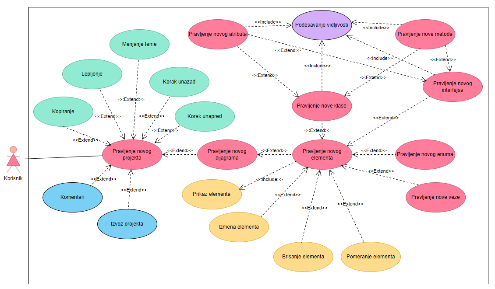

Anđela Komnenić RN 13/2022

Irina Radojević RN 27/2022

Specifikacija: https://www.notion.so/ClassyCrafT-68b24bff9779490591b1794c24678f50?pvs=4

# ClassyCrafT

# Uvod:

ClassyCrafT je alat koji obezbeđuje funkcionalnosti za pravljenje UML dijagrama. Alat sadrži opcije za pravljenje klasa, enuma, interfejsa, kao i definisanje vidljivosti njihovih atributa i metoda. Samim time omogućeno je uspostavljanje veza izmedju istih. Pored navedenih mogućnosti, alat omogućava izvoz finalnog projekta.

# Rečnik:

Klasa: predstavlja obrazac po kom će se kreirati objekti. Definiše njihovo stanje i ponašanje.

Objekat: (konkretna) instanca klase.

Metoda: predstavlja operaciju koju objekat ili klasa izvršava, odnosno opisuje njihovo ponašanje.

Veza: predstavlja odnos između različitih objekata ili klasa, koji omogućava interakciju i komunikaciju izmedju njih.

Interfejs: predstavlja skup metoda koje klasa ili objekat treba da implementira.

Enum: (Enumeracija) je poseban tip podataka kojim se definiše konačan skup konkretnih i konstantnih vrednosti.

Atribut: koristi se za predstavljanje stanja objekta. Omogućava čuvanje informacija i njihovu manipulaciju.

Vidljivost: se odnosi na kontrolu prava pristupa metodama i atributima određene klase iz ostatka programa.

Nasleđivanje: omogućava pravljenje novih klasa, koje će imati polja i metode klase koju nasleđuju.

UML: prevedeno na srpski - objedinjeni jezik za modelovanje, koristi se za vizuelno prikazivanje modela podataka.

Dijagram: se koristi za vizuelno prikazivanje modela strukture i odnosa izmedju klasa, objekata i njihovih elemenata.

# Ciljna grupa:

ClassyCrafT je pogodan alat za softverske inženjere i programere, pomoću kog mogu grafički predstavljati potrebne podatke vezane za modele i projekte na kojim rade. Administratori baza podataka mogu koristiti program kako bi predstavili sve informacije vezane za bazu, tabele i njihove međusobne veze. Program je koristan kako za studente, tako i za profesore, jer se moze koristiti za učenje i grafičko predstavljanje podataka u raznim granama programiranja. Programerski stručnjaci mogu koristiti UML dijagrame klasa kako bi približili dizajn sistema klijentima i olakšali razumevanje i donošenje odluka tokom programerskih projekata.

# Konkurencija

| Ime | Desktop klijent | Veb verzija aplikacije | Mobilna verzija aplikacije | Sarađivanje | Menjanje teme | Komentari |
| --- | --- | --- | --- | --- | --- | --- |
| ClassyCrafT | ✅ | ❌ | ❌ | ❌ | ✅ | ✅ |
| LucidChart | ✅ | ✅ | ✅ | ✅ | ❌ | ✅ |
| Papyrus | ✅ | ❌ | ❌ | ❌ | ❌ | ✅ |
| Gleek | ✅ | ✅ | ❌ | ✅ | ❌ | ❌ |
| Moqups | ✅ | ✅ | ❌ | ✅ | ❌ | ✅ |
| Staruml | ✅ | ❌ | ❌ | ❌ | ✅ | ❌ |
| Visual-paradigm | ✅ | ✅ | ✅ | ✅ | ✅ | ✅ |

# Zahtevi

U opisu zahteva je za svaki naveden njegov nivo prioriteta:

- visok prioritet označava da program ne može da funkcioniše bez navedene funkcionalnosti.
- srednji prioritet označava da je poželjno da program ima navedenu funkcionalnost, ali je moguće korišćenje aplikacije ukoliko zahtev nije ispunjen.
- nizak prioritet označava da je u pitanju funkcionalnost bez koje je upotreba programa u potpunosti moguća.
1. Operacije nad klasama UML dijagrama
    1. Kreiranje
        
        Potrebno je da postoji mogućnost kreiranja nove klase u UML dijagramu, kako bi se predstavili željeni podaci. Prioritet je visok, a rizik nizak.
        
    2. Vizuelizacija
        
        Nakon što je dodata nova klasa, ona se i grafički prikazuje. Ovime se omogućava pregled do sada napravljenih elemenata. Prioritet je visok, a rizik nizak.
        
    3. Brisanje
        
        Potrebno je da postoji mogućnost brisanja ranije kreiranih klasa, ukoliko vise nisu potrebne. Rizik je da korisnik greškom ne obriše pogrešnu klasu, odnosno neku koja je jos uvek potrebna u projektu, dok je prioritet visok.
        
    4. Podešavanje vidljivosti
        
        Nakon što je dodata nova klasa, potrebno je da postoji mogućnost podešavanja njene vidljivosti. Prioritet je visok, a rizik nizak. 
        
    5. Uređivanje
        
        Već dodate klase treba da imaju mogucnost da im se menjaju zadate vrednosti, kao i struktura. Prioritet je srednji, a rizik je mogucnost da korisnik promeni vrednost polja koje nije zeleo da promeni.
        
2. Operacije nad atributima klasa
    1. Kreiranje
        
        Nakon sto je klasa kreirana, treba da postoji mogucnost dodavanja njenih polja (atributa). Prioritet je visok, a rizik nizak.
        
    2. Vizuelizacija
        
        Kada je dodat novi atribut neke klase, potrebno je to i graficki prikazati, kako bi postojao pregled urađenih stvari. Prioritet je visok, dok je rizik nizak.
        
    3. Brisanje
        
        Nakon što je dodat novi atribut, treba da postoji opcija za njegovo brisanje. Rizik predstavlja mogućnost brisanja atributa koji su jos uvek potrebni, dok je prioritet visok.
        
    4. Podešavanje vidljivosti
        
        Potrebno je da postoji mogućnost podešavanja vidljivosti atributa, kako bi se predstavio željeni model podataka. Prioritet je visok, dok je rizik nizak.
        
    5. Uređivanje
        
        Nakon što je atribut dodat, potrebno je da postoji opcija za njegovu izmenu. Prioritet je srednji, dok mogucnost menjanja pogrešnih atributa predstavlja rizik.
        
3. Operacije nad metodama
    1. Kreiranje
        
        Potrebno je da postoji mogućnost kreiranja novih metoda, kako bi se opisalo ponašanje klasa. Prioritet je visok, dok je rizik nizak.
        
    2. Vizuelizacija
        
        Nakon sto je metoda dodata, potrebno je graficki prikazati je, radi mogućnosti pregleda modela podataka. Prioritet je visok, a rizik je nizak.
        
    3. Brisanje
        
        Potrebno je da postoji mogućnost brisanja ranije dodate metode. Rizik predstavlja mogućnost da će korisnik obrisati metodu koja mu je jos uvek potrebna, dok je prioritet visok.
        
    4. Podešavanje vidljivosti
        
        Radi predstavljanja našeg modela, neophodno je da postoji mogućnost podešavanja vidljivosti željene metode. Prioritet je visok, a rizik je nizak.
        
    5. Uređivanje
        
        Trebalo bi da postoji mogućnost izmene ranije dodatih metoda, za slučaj da se menja struktura modela, ili je došlo do greske. Prioritet je srednji, dok je rizik nizak i predstavlja mogućnost da korisnik izmeni pogrešnu metodu.
        
4. Operacije nad vezama u UML dijagramu
    1. Kreiranje
        
        Potrebno je da postoji mogućnost međusobnog povezivanja elemenata dijagrama (klasa, intrfejsa, enuma…) različitim vrstama veza. Prioritet ove funkcionalnosti je visok, dok je rizik nizak.
        
    2. Vizuelizacija
        
        Izmedju povezanih elemenata treba i grafički prikazati vezu i to svaku vezu na način koji je prihvaćen u UML notaciji. Prioritet je visok, dok je rizik nizak.
        
    3. Brisanje
        
        Potrebno je da postoji mogucnost brisanja veza izmedju različitih elemenata UML dijagrama, ukoliko one nisu potrebne na istom. Prioritet je visok, dok rizik predstavlja mogućnost brisanja pogrešne veze.
        
    4. Uređivanje
        
        Nakon što su dva elementa na dijagramu povezana, potrebno je da postoji mogućnost naknadnog uređivanja njihove veze. Ovo omogućava prilagođavanje modela ukoliko se ideja ili struktura promenila, kao i ispravljanje grešaka ukoliko dodje do njih. Prioritet je srednji, dok rizik predstavlja mogućnost da korisnik izmeni pogrešnu vezu.
        
5. Operacije nad svim elementima UML dijagrama
    1. Mogucnost kopiranja i lepljenja
        
        Kako često postoji potreba pravljenja sličnih ili čak istih elemenata dijagrama, mogućnost kopiranja i zatim lepljenja kopiranog sadržaja olakšava i ubrzava proces izrade modela. Prioritet je nizak, isto kao i rizik.
        
    2. Korišćenje prečica
        
        Radi lakšeg i bržeg korišćenja alata, poželjno je da postoji mogućnost korišćenja prečica za kopiranje, lepljenje… Kako u pitanju nije neophodna funkcionalnost, već služi za poboljšanje iskustva korisnika, prioritet je nizak, kao i rizik.
        
    3. Korak unapred i korak unazad
        
        Mogućnost vraćanja korak unazad i suprotno od toga - odlaska korak unapred olakšava i ubrzava proces izrade dijagrama, jer ukoliko dođe do greške nije potrebno od početka praviti element već je dovoljno vratiti se unazad i sl. Prioritet je srednji, dok je rizik nizak.
        
    4. Odabir elementa
        
        Kako bi elementi UML dijagrama koji su dodati, naknadno mogli da se uređuju, pomeraju, brišu ili na bilo koji nacin menjaju svoje stanje, neophodno je označiti ih. Potrebno je da postoji mogućnost odabira jednog elementa klikom na njega, kao i odabira jednog ili više elemenata pomoću okvira za odabir. Odabrani elementi se i na radnoj povrsini prikazuju pomalo promenjenog izgleda, kako bi korisnik imao uvid. Prioritet je srednji, dok je rizik nizak.
        
    5. Pomeranje elemenata po radnoj površini
        
        Potrebno je da korisnik ima mogućnost pomeranja elemenata po radnoj površini, kako bi mogao da model prilagođava svojim potrebama. Pomeranje se vrši korišćenjem miša, odnosno njegovim prevlačenjem od trenutne do željene pozicije. Prioritet je nizak, kao i rizik.
        
    6. Dodavanje komentara
        
        Nakon što je određen element dijagrama odabran, potrebno je da postoji mogućnost dodavanja komentara koji se odnosi na njega. Komentari se prikazuju u odvojenoj sekciji sa strane, gde je naznačeno na koji element se komentar odnosi, a ispod toga je prikazan i sadržaj komentara. Prioritet je nizak, kao i rizik.
        
6. Funkcionalnosti na nivou celog programa
    1. Pravljenje novog projekta
        
        Potrebno je da postoji mogućnost pravljenja novog projekta. Prioritet ove funkcionalnosti je visok, dok je rizik nizak.
        
    2. Izvoz projekta
        
        Nakon što je projekat napravljen, potrebno je da postoji opcija za njegov izvoz, radi mogućnosti njegove dalje upotrebe. Prioritet je srednji, a rizik je nizak.
        
    3. Menjanje teme
        
        Potrebno je da postoji mogućnost promene teme. Od opcija postoje tamna i svetla tema i korisnik ima mogucnost prelaska iz jedne u drugu u bilo kom trenutku korišćenja alata. Prioritet je nizak, kao i rizik.
        
    4. Pretraživanje projekta
        
        Potrebno je da postoji mogućnost pretraživanja projekta, radi pronalaženja željenih elemenata dijagrama. Tekst koji se unese u polje za pretraživanje se poredi sa nazivima svih dodatih klasa, enuma, atributa, metoda, interfejsa, kao i veza, pa ukoliko postoji element sa istim nazivom on se nudi korisniku za odabir. I prioritet i rizik su niskog nivoa.
        
    5. Mogućnost korišćenja karaktera van ASCII standarda
        
        Prilikom imenovanja svih elemenata projekta, kao i unosa teksta u bilo kom trenutku pri korišćenju alata, postoji potreba za mogućim unosom karaktera koji nisu podržani ASCII standardom. Prioritet je nizak, a takođe je i rizik nizak.
        

# Funkcionalni dijagram

# UseCase:

## Pravljenje **novog projekta 🟥**

Akteri: Korisnik

Preduslovi: Korisnik prethodno treba da otvori program ClassyCrafT

Opis: Pravi se novi projekat

Koraci: Korisnik u meniju bira opciju za pravljenje novog projekta

Izuzeci: Korisnik ne može da napravi nikakvu neočekivanu grešku pri pravljenju novog projekta

Stanje: Napravi se novi prazan projekat i postaju vidljive dodatne opcije

Tačke proširenja: Pravljenje novog dijagrama, kopiranje, lepljenje, menjanje teme, korak unazad, korak unapred, komentari, izvoz projekta 

## Pravljenje **novog dijagrama 🟥**

Akteri: Korisnik

Preduslovi: Korisnik prethodno treba da napravi projekat

Opis: Pravi se novi prostor za dijagram na radnom prostoru

Koraci: Korisnik u meniju bira opciju za pravljenje novog dijagrama

Izuzeci: Korisnik ne može da napravi nikakvu neočekivanu grešku pri pravljenju novog dijagrama

Stanje: Napravi se prazan prostor za pravljenje dijagrama

Tačke proširenja: Pravljenje novog elementa

## Pravljenje **novog elementa 🟥**

Akteri: Korisnik

Preduslovi: Korisnik prethodno treba da napravi dijagram

Opis: Korisnik pravi novi element

Koraci: Korisnik u meniju bira opciju za pravljenje novog elementa

Izuzeci: Korisnik ne može da napravi nikakvu neočekivanu grešku pri pravljenju novog elementa

Stanje: Pravi se novi element koji je korisnik izabrao

Tačke proširenja: Pravljenje nove klase, pravljenje novog atributa, pravljenje nove metode, pravljenje novog enuma, pravljenje nove veze, modifikovanje elementa, prisanje elementa, pomeranje elementa

## Pravljenje **nove klase 🟥**

Akteri: Korisnik

Preduslovi: Korisnik prethodno treba da izabere opciju za pravljenje novog elementa

Opis: Korisnik pravi novu klasu

Koraci: Korisnik nakon odabira opcije za pravljenje novog elementa bira opciju za pravljenje nove klase

Izuzeci: Korisnik ne može da napravi nikakvu neočekivanu grešku pri pravljenju nove klase

Stanje: Pravi se nova klasa

Tačke proširenja: Pravljenje novog atributa, pravljenje nove metode

## Pravljenje **novog atributa 🟥**

Akteri: Korisnik

Preduslovi: Korisnik prethodno treba da izabere opciju za pravljenje nove klase ili interfejsa

Opis: Korisnik pravi novi atribut za klasu ili interfejs

Koraci: Korisnik nakon odabira klase ili interfejsa, dobija opciju da upisuje dalje osobine atributa

Izuzeci: Korisnik ne može da napravi nikakvu neočekivanu grešku pri pravljenju novog atributa

Stanje: Pravi se novi atribut za izabranu klasu ili interfejst

Tačke proširenja: /

## Pravljenje **nove metode 🟥**

Akteri: Korisnik

Preduslovi: Korisnik prethodno treba da izabere opciju za pravljenje nove klase ili interfejsa

Opis: Korisnik pravi novu metodu za klasu ili interfejs

Koraci: Korisnik nakon odabira klase ili interfejsa, dobija opciju da upisuje dalje osobine metode

Izuzeci: Korisnik ne može da napravi nikakvu neočekivanu grešku pri pravljenju nove metode

Stanje: Pravi se nova metoda za izabranu klasu ili interfejst

Tačke proširenja: /

## Pravljenje **novog interfejsa 🟥**

Akteri: Korisnik

Preduslovi: Korisnik prethodno treba da izabere opciju za pravljenje novog elementa

Opis: Korisnik pravi novi interfejs

Koraci: Korisnik nakon odabira opcije za pravljenje novog elementa bira opciju za pravljenje novog interfejsa

Izuzeci: Korisnik ne može da napravi nikakvu neočekivanu grešku pri pravljenju novog interfejsa

Stanje: Pravi se novi interfejs

Tačke proširenja: Pravljenje novog atributa, pravljenje nove metode

## Pravljenje **novog enuma 🟥**

Akteri: Korisnik

Preduslovi: Korisnik prethodno treba da izabere opciju za pravljenje novog elementa

Opis: Korisnik pravi novi enum

Koraci: Korisnik nakon odabira opcije za pravljenje novog elementa bira opciju za pravljenje novog enuma

Izuzeci: Korisnik ne može da napravi nikakvu neočekivanu grešku pri pravljenju nove klase

Stanje: Pravi se novi enum

Tačke proširenja: /

## Pravljenje **nove veze 🟥**

Akteri: Korisnik

Preduslovi: Korisnik prethodno treba da izabere opciju za pravljenje novog elementa

Opis: Korisnik pravi novu vezu

Koraci: Korisnik nakon odabira opcije za pravljenje novog elementa bira opciju za pravljenje nove veze

Izuzeci: Korisnik ne može da napravi nikakvu neočekivanu grešku pri pravljenju nove veze

Stanje: Pravi se nova veza

Tačke proširenja: /

## Podešavanje vidljivosti **🟪**

Akteri: Korisnik

Preduslovi: Korisnik prethodno treba da izabere opciju za pravljenje nove metode ili atributa

Opis: Korisnik menja vidljivost izabrane metode ili atributa

Koraci: Korisnik nakon odabira izabranog atributa ili metodeč dobija opciju za upis njihove vidljivosti

Izuzeci: Korisnik ne može da napravi nikakvu neočekivanu grešku pri podešavanju vidljivosti

Stanje: Menja se vidljivost izabrane metode ili atributa

Tačke proširenja: /

## **Kopiranje 🟩**

Akteri: Korisnik

Preduslovi: Korisnik prethodno treba da otvori projekat

Opis: Korisnik kopira izabrani element

Koraci: Korisnik uz pomoć ikonica ili prečica na tastaturi kopira izabrani element

Izuzeci: Korisnik ne može da napravi nikakvu neočekivanu grešku pri kopiranju izabranog elementa

Stanje: Kopira se izabrani element

Tačke proširenja: /

## Lepljenje **🟩**

Akteri: Korisnik

Preduslovi: Korisnik prethodno treba da otvori projekat

Opis: Korisnik lepi izabrani element

Koraci: Korisnik uz pomoć ikonica ili prečica na tastaturi lepi izabrani element

Izuzeci: Korisnik ne može da napravi nikakvu neočekivanu grešku pri lepljenju izabranog elementa

Stanje: Lepi se izabrani element na radnu površinu

Tačke proširenja: /

## Menjanje teme **🟩**

Akteri: Korisnik

Preduslovi: Korisnik prethodno treba da otvori projekat

Opis: Korisnik menja izgled boja na projektu

Koraci: Korisnik uz pomoć ikonica menja izgled boja na projektu

Izuzeci: Korisnik ne može da napravi nikakvu neočekivanu grešku pri menjanju teme

Stanje: Menja se izgled boja projekta

Tačke proširenja: /

## Korak unazad **🟩**

Akteri: Korisnik

Preduslovi: Korisnik prethodno treba da otvori projekat

Opis: Korisnik vraća program jedan korak unazad

Koraci: Korisnik uz pomoć ikonica ili prečica na tastaturi vraća program jedan korak unazad

Izuzeci: Korisnik ne može da napravi nikakvu neočekivanu grešku pri izvršavanju koraka unazad

Stanje: Vraća se program jedan korak unazad

Tačke proširenja: /

## Korak unapred **🟩**

Akteri: Korisnik

Preduslovi: Korisnik prethodno treba da otvori projekat

Opis: Korisnik vraća program jedan korak unapred

Koraci: Korisnik uz pomoć ikonica ili prečica na tastaturi vraća program jedan korak unapred

Izuzeci: Korisnik ne može da napravi nikakvu neočekivanu grešku pri izvršavanju koraka unapred

Stanje: Vraća se program jedan korak unapred

Tačke proširenja: /

## Komentari **🟦**

Akteri: Korisnik

Preduslovi: Korisnik prethodno treba da otvori projekat

Opis: Korisnik dodaje novi komentar

Koraci: Korisnik uz pomoć menija dodaje novi komentar

Izuzeci: Korisnik ne može da napravi nikakvu neočekivanu grešku pri dodavanju novog komentara

Stanje: Na radnoj površini se prikazuje napravljeni komentar

Tačke proširenja: /

## Izvoz **🟦**

Akteri: Korisnik

Preduslovi: Korisnik prethodno treba da otvori projekat

Opis: Korisnik izvozi projekat

Koraci: Korisnik uz pomoć menija izvozi napravljeni projekat

Izuzeci: Korisnik ne može da napravi nikakvu neočekivanu grešku pri izvozu projekta

Stanje: Projekat se izvozi u izabranom formatu

Tačke proširenja: /

## Prikaz elementa **🟨**

Akteri: Korisnik

Preduslovi: Korisnik prethodno treba da napravi novi element

Opis: Grafički prikaz elementa

Koraci: /

Izuzeci: Ne može da se napravi nikakva neočekivana greška pri prikazu elementa

Stanje: Na radnoj površini se prikazuje novi element

Tačke proširenja: /

## Izmena elementa **🟨**

Akteri: Korisnik

Preduslovi: Korisnik prethodno treba da napravi novi element

Opis: Odabrani element se izmenjuje

Koraci: Korisnik odabirom opcije za izmenu elementa dobija mogućnost izmene elementa

Izuzeci: Korisnik ne može da napravi nikakvu neočekivanu grešku pri izmeni elementa

Stanje: Na radnoj površini prikazuju novonapravljene izmene na elementu

Tačke proširenja: /

## Brisanje elementa **🟨**

Akteri: Korisnik

Preduslovi: Korisnik prethodno treba da napravi novi element

Opis: Odabrani element se briše

Koraci: Korisnik odabirom opcije za brisanje elementa dobija mogućnost brisanje elementa

Izuzeci: Korisnik ne može da napravi nikakvu neočekivanu grešku pri brisanju elementa

Stanje: Na radnoj površini se uklanja izabrani element

Tačke proširenja: /

## Pomeranje elementa **🟨**

Akteri: Korisnik

Preduslovi: Korisnik prethodno treba da napravi novi element

Opis: Menjanje pozicije elementa

Koraci: Korisnik odabirom opcije za pomeranje elementa dobija mogućnost pomeranje elementa po radnoj površini

Izuzeci: Korisnik ne može da napravi nikakvu neočekivanu grešku pri pomeranju elementa

Stanje: Izabrani element promeni svoju poziciju na radnoj površini

Tačke proširenja: /
